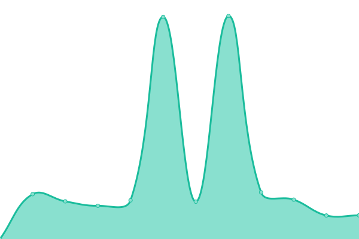

# [📈 Live Status](https://demo.upptime.js.org): <!--live status--> **🟧 Partial outage**

This repository contains the open-source uptime monitor and status page for [EvanLuo](https://evanluo.top/), powered by [Upptime](https://github.com/upptime/upptime).

With [Upptime](https://upptime.js.org), you can get your own unlimited and free uptime monitor and status page, powered entirely by a GitHub repository. We use [Issues](https://github.com/EvanLuo233/AnonymousLandStatus/issues) as incident reports, [Actions](https://github.com/EvanLuo233/AnonymousLandStatus/actions) as uptime monitors, and [Pages](https://demo.upptime.js.org) for the status page.

<!--start: status pages-->
<!-- This summary is generated by Upptime (https://github.com/upptime/upptime) -->
<!-- Do not edit this manually, your changes will be overwritten -->
<!-- prettier-ignore -->
| URL | Status | History | Response Time | Uptime |
| --- | ------ | ------- | ------------- | ------ |
|  [Anonymous Land Blog 主站](https://www.evanluo.top) | 🟩 Up | [anonymous-land-blog.yml](https://github.com/EvanLuo233/AnonymousLandStatus/commits/HEAD/history/anonymous-land-blog.yml) | 

 2594ms
     
 | 

<a href="https://status.evanluo.top/history/anonymous-land-blog">99.65%</a>
    

|  [Anonymous Land Cloud 网盘](https://cloud.evanluo.top) | 🟩 Up | [anonymous-land-cloud.yml](https://github.com/EvanLuo233/AnonymousLandStatus/commits/HEAD/history/anonymous-land-cloud.yml) | 

 8556ms
     
 | 

<a href="https://status.evanluo.top/history/anonymous-land-cloud">98.56%</a>
    

|  [Anonymous Land Status 状态页面](https://status.evanluo.top) | 🟩 Up | [anonymous-land-status.yml](https://github.com/EvanLuo233/AnonymousLandStatus/commits/HEAD/history/anonymous-land-status.yml) | 

 1033ms
     
 | 

<a href="https://status.evanluo.top/history/anonymous-land-status">100.00%</a>
    

|  [Alexwei的部落格](http://alexwei.top) | 🟩 Up | [alexwei.yml](https://github.com/EvanLuo233/AnonymousLandStatus/commits/HEAD/history/alexwei.yml) | 

 6998ms
     
 | 

<a href="https://status.evanluo.top/history/alexwei">96.39%</a>
    

|  [Minecreeper的小站](https://minecreeper.evanluo.top) | 🟩 Up | [minecreeper.yml](https://github.com/EvanLuo233/AnonymousLandStatus/commits/HEAD/history/minecreeper.yml) | 

 10322ms
     
 | 

<a href="https://status.evanluo.top/history/minecreeper">97.14%</a>
    

|  [Minecraft 面板服](https://tc.yunqiaold.cn) | 🟥 Down | [minecraft.yml](https://github.com/EvanLuo233/AnonymousLandStatus/commits/HEAD/history/minecraft.yml) | 

 0ms
     
 | 

<a href="https://status.evanluo.top/history/minecraft">0.00%</a>
    

<!--end: status pages-->

[**Visit our status website →**](https://demo.upptime.js.org)

## 📄 License

- Powered by: [Upptime](https://github.com/upptime/upptime)
- Code: [MIT](./LICENSE) © [EvanLuo](https://evanluo.top/)
- Data in the `./history` directory: [Open Database License](https://opendatacommons.org/licenses/odbl/1-0/)
